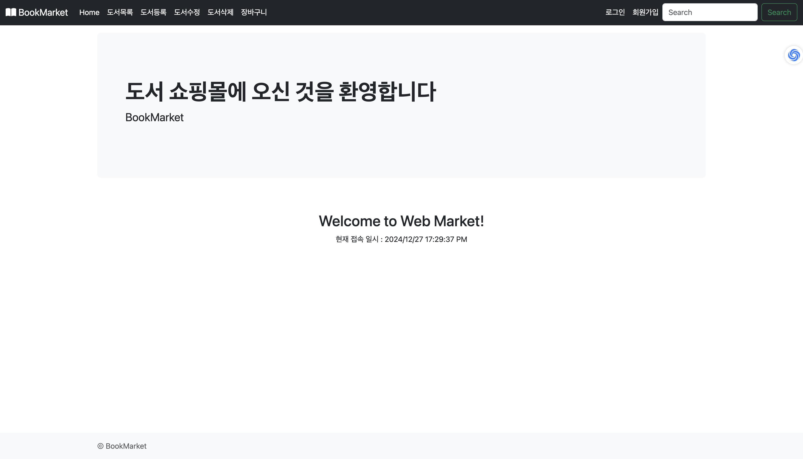
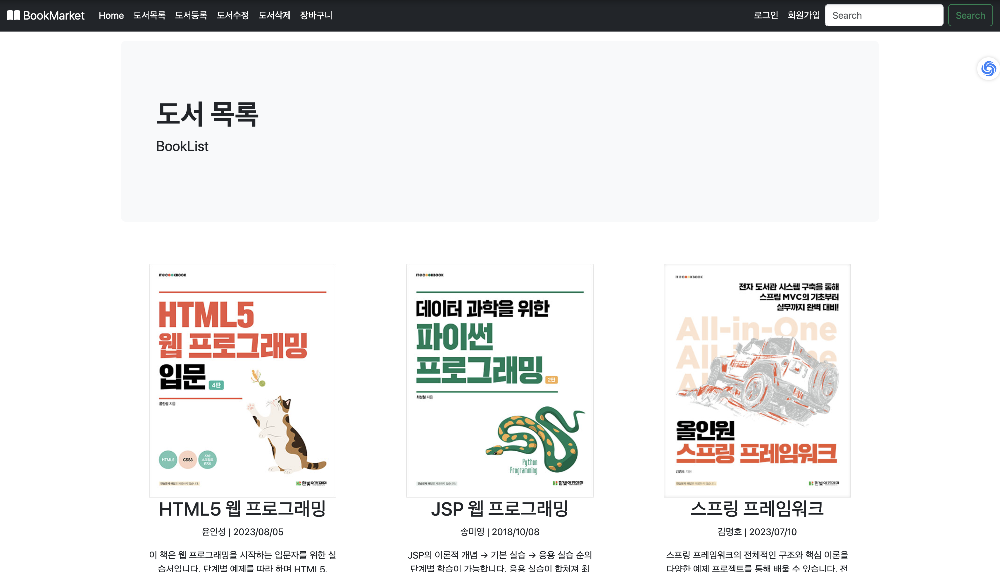
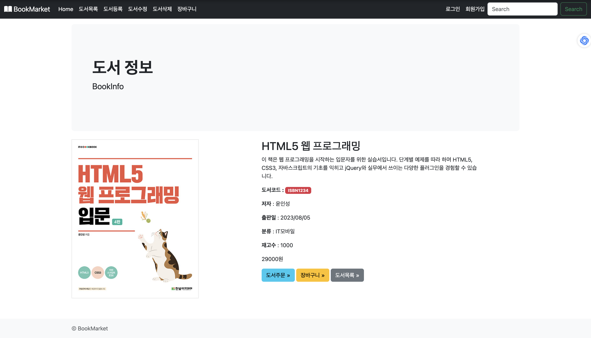
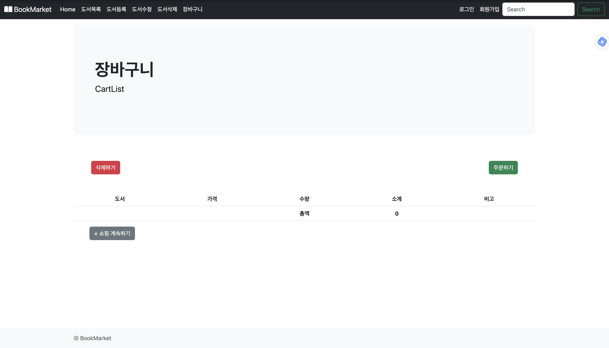
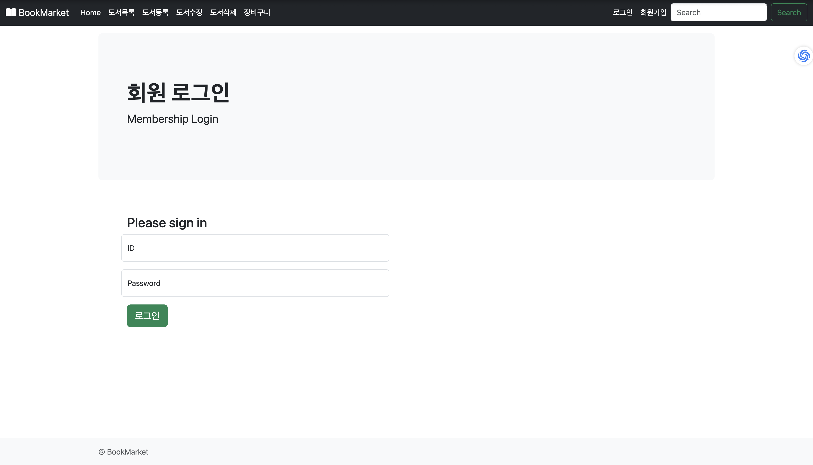

# 📚 **BookMarket**

**BookMarket**은 PHP, HTML5, CSS, JavaScript 및 MySQL을 활용해 개발된 **온라인 서점** 웹 애플리케이션입니다. 사용자는 책을 검색하고, 장바구니에 추가하며, 주문 및 결제 과정을 시뮬레이션할 수 있습니다.

---

## 🌐 **호스팅된 웹사이트 사용 방법**

BookMarket은 아래 링크를 통해 바로 체험할 수 있습니다:

🔗 **[BookMarket 웹사이트](http://openshelf.great-site.net/bookmarket/welcome.php)**

1. **회원 가입**을 통해 계정을 생성하세요.
2. 다양한 도서를 탐색하고, 장바구니에 추가해보세요.
3. 주문 과정을 시뮬레이션하며 애플리케이션의 기능을 경험해보세요.

---

## 📋 **주요 기능**

### 1. **도서 관리**
- 도서 추가, 수정, 삭제 기능
- 도서 목록 페이지에서 도서 정보 확인

### 2. **회원 관리**
- 회원 가입, 로그인, 로그아웃
- 회원 정보 수정 및 삭제

### 3. **장바구니 및 주문**
- 장바구니 추가, 삭제
- 주문 확인 및 결제 과정 시뮬레이션

### 4. **에러 처리**
- 잘못된 요청이나 누락된 정보에 대한 예외 처리 페이지 제공

---

## 💻 **기술 스택**

- **Frontend**: HTML5, CSS (Bootstrap), JavaScript
- **Backend**: PHP
- **Database**: MySQL

---

## 🖼️ 실행 화면 예시

<table> <tr> <td align="center"> <b>홈 화면</b><br>  <p>BookMarket의 홈 화면으로, 사용자는 추천 도서를 확인하고 원하는 도서 카테고리로 이동할 수 있습니다.</p> </td> <td align="center"> <b>도서 목록</b><br>  <p>등록된 모든 도서를 한눈에 볼 수 있는 페이지입니다. 사용자는 도서를 클릭하여 상세 정보를 확인할 수 있습니다.</p> </td> </tr> <tr> <td align="center"> <b>도서 정보</b><br>  <p>선택한 도서의 상세 정보를 보여줍니다. 제목, 저자, 가격 등 주요 정보가 포함되어 있습니다.</p> </td> <td align="center"> <b>장바구니</b><br>  <p>장바구니에 추가된 도서들을 확인할 수 있는 페이지입니다. 사용자는 도서를 삭제하거나 구매를 진행할 수 있습니다.</p> </td> </tr> <tr> <td align="center"> <b>로그인</b><br>  <p>기존 회원은 이메일과 비밀번호로 로그인할 수 있는 화면입니다.</p> </td> <td align="center"> <b>회원 가입</b><br>  <p>새로운 회원이 간단한 정보를 입력하여 계정을 생성할 수 있는 화면입니다.</p> </td> </tr> </table>

---

## 🚀 향후 추가 예정 기능

- **결제 시스템**: 실제 결제 API 연동
- **도서 리뷰**: 사용자 리뷰 작성 및 평가 시스템
- **추천 도서**: 사용자의 관심사 기반 도서 추천 기능

---

## 📂 **파일 구조**

```plaintext
bookmarket/
├── addBook.php                 # 도서 추가 페이지
├── books.php                   # 도서 목록 페이지
├── cart.php                    # 장바구니 관리 페이지
├── checkoutCancelled.php       # 결제 취소 처리
├── dbconn.php                  # 데이터베이스 연결 파일
├── deleteBook.php              # 도서 삭제 기능
├── editsBooks.php              # 도서 수정 및 삭제 페이지
├── footer.php                  # 공통 하단 파일
├── menu.php                    # 공통 상단 메뉴 파일
├── orderConfirmation.php       # 주문 확인 페이지
├── processAddBook.php          # 도서 추가 처리
├── processShippingInfo.php     # 배송 정보 처리
├── processUpdateBook.php       # 도서 수정 처리
├── removeCart.php              # 장바구니 항목 삭제 처리
├── shippingInfo.php            # 배송 정보 입력 페이지
├── thankCustomer.php           # 주문 완료 페이지
├── updateBook.php              # 도서 수정 페이지
├── welcome.php                 # 메인 페이지
├── resources/                  # 정적 리소스 디렉터리
│   ├── css/
│   │   └── bootstrap.min.css   # CSS 파일
│   ├── images/
│   │   ├── home.png            # 홈 화면 이미지
│   │   ├── books.png           # 도서 목록 이미지
│   │   ├── cart.png            # 장바구니 이미지
│   │   ├── signup.png          # 회원 가입 이미지
│   │   └── ...                 # 기타 이미지
│   └── js/
│       └── validation.js       # 유효성 검사 스크립트
└── member/                     # 회원 관련 파일
    ├── addMember.php           # 회원 가입 페이지
    ├── createTable.php         # 회원 테이블 생성 스크립트
    ├── deleteMember.php        # 회원 삭제 기능
    ├── loginMember.php         # 로그인 페이지
    ├── logoutMember.php        # 로그아웃 처리
    ├── processAddMember.php    # 회원 가입 처리
    ├── processLoginMember.php  # 로그인 처리
    ├── processUpdateMember.php # 회원 정보 수정 처리
    ├── resultMember.php        # 회원 결과 페이지
    └── updateMember.php        # 회원 정보 수정 페이지
