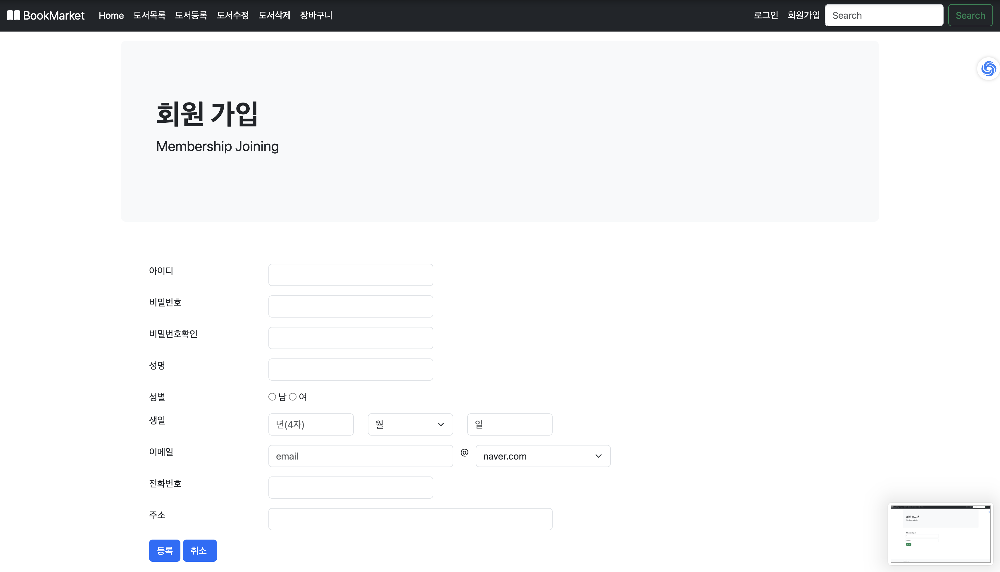

# 📚 BookMarket

**BookMarket**은 PHP, HTML5, CSS, JavaScript 및 MySQL을 활용해 개발된 임의 **온라인 서점** 웹 애플리케이션입니다. 사용자는 책을 검색하고, 장바구니에 추가하며, 주문 및 결제 과정을 시뮬레이션할 수 있습니다.

## 📋 주요 기능

1. **도서 관리**
   - 도서 추가, 수정, 삭제 기능
   - 도서 목록 페이지에서 도서 정보 확인

2. **회원 관리**
   - 회원 가입, 로그인, 로그아웃
   - 회원 정보 수정 및 삭제

3. **장바구니 및 주문**
   - 장바구니 추가, 삭제
   - 주문 확인 및 결제 과정 시뮬레이션

4. **에러 처리**
   - 잘못된 요청이나 누락된 정보에 대한 예외 처리 페이지 제공

## 💻 기술 스택

- **Frontend**: HTML5, CSS (Bootstrap), JavaScript
- **Backend**: PHP
- **Database**: MySQL

## 📂 파일 구조

- `addBook.php` : 도서 추가 페이지
- `books.php` : 도서 목록 페이지
- `cart.php` : 장바구니 관리 페이지
- `checkoutCancelled.php` : 결제 취소 처리
- `welcome.php` : 시작 페이지
- **회원 관련 파일**:
  - `loginMember.php` : 로그인 페이지
  - `addMember.php` : 회원 가입 페이지
  - `deleteMember.php` : 회원 삭제 기능

## 🖼️ 실행 화면 예시

<table>
<tr>
<td align="center">
<b>홈 화면</b> 

BookMarket의 홈 화면으로, 사용자는 추천 도서를 확인하고 원하는 도서 카테고리로 이동할 수 있습니다.

</td>
<td align="center">
<b>도서 목록</b> 

등록된 모든 도서를 한눈에 볼 수 있는 페이지입니다. 사용자는 도서를 클릭하여 상세 정보를 확인할 수 있습니다.

</td>
</tr>
<tr>
<td align="center">
<b>도서 정보</b> 

선택한 도서의 상세 정보를 보여줍니다. 제목, 저자, 가격 등 주요 정보가 포함되어 있습니다.

</td>
<td align="center">
<b>장바구니</b> 

장바구니에 추가된 도서들을 확인할 수 있는 페이지입니다. 사용자는 도서를 삭제하거나 구매를 진행할 수 있습니다.

</td>
</tr>
<tr>
<td align="center">
<b>로그인</b> 

기존 회원은 이메일과 비밀번호로 로그인할 수 있는 화면입니다.

</td>
<td align="center">
<b>회원 가입</b> 

새로운 회원이 간단한 정보를 입력하여 계정을 생성할 수 있는 화면입니다.

</td>
</tr>
</table>

## 🚀 향후 추가 예정 기능

- **결제 시스템**: 실제 결제 API 연동
- **도서 리뷰**: 사용자 리뷰 작성 및 평가 시스템
- **추천 도서**: 사용자의 관심사 기반 도서 추천 기능

